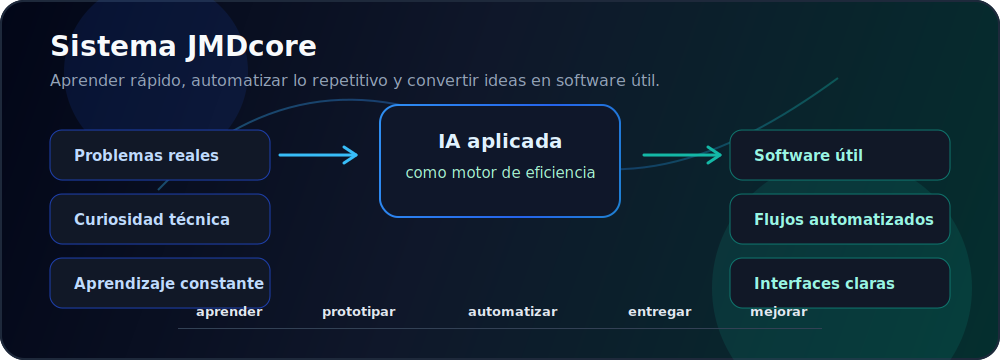
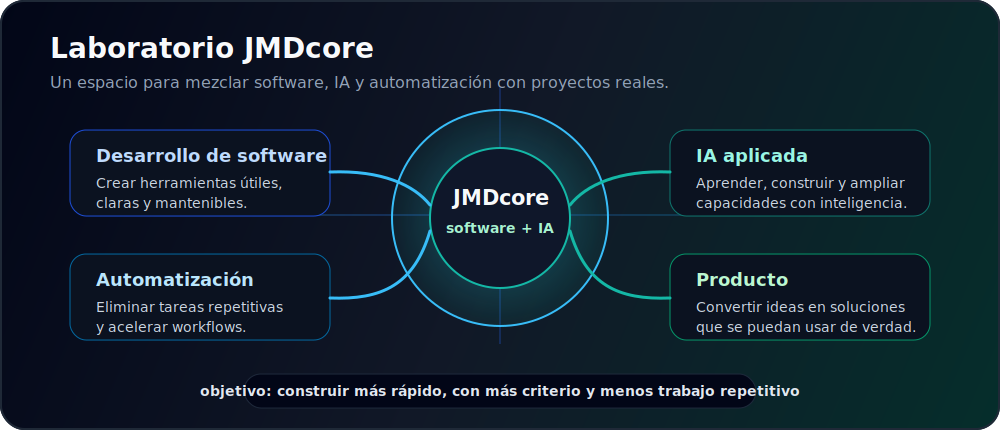

---

## Hola, soy José Miguel Díaz

Estudiante de **Ingeniería Informática** en la Universidad de La Laguna, terminando la carrera y construyendo proyectos propios en paralelo bajo la marca **JMDcore**.

Creo productos digitales prácticos, con foco en claridad, automatización y utilidad real. Muchos de mis proyectos nacen como hobby y como forma de aprender, pero también estoy abierto a colaborar y desarrollar soluciones software para empresas, equipos o proyectos que necesiten una base técnica limpia, eficiente y escalable.

La inteligencia artificial es una parte muy importante de mi forma de aprender, trabajar y construir. Estoy en constante aprendizaje sobre IA, herramientas, agentes, automatizaciones y flujos de trabajo, e intento aprovecharla todo lo posible para ganar eficiencia, velocidad y alcance en los proyectos que desarrollo.

## Ahora mismo

- Terminando la carrera de Ingeniería Informática en la Universidad de La Laguna.
- Desarrollando proyectos propios en paralelo, principalmente como hobby y espacio de aprendizaje.
- Abierto a colaborar en proyectos software para empresas, equipos o iniciativas independientes.
- Aprendiendo continuamente sobre inteligencia artificial y cómo aplicarla al desarrollo real.
- Usando IA siempre que puedo para mejorar eficiencia, velocidad de desarrollo, calidad y alcance.
- Explorando automatizaciones, agentes de IA y herramientas internas que eliminan trabajo repetitivo.

## Stack y herramientas

## Proyectos destacados

| Proyecto | Enfoque | Stack |
| --- | --- | --- |
| [JMD-ClientFlow](https://github.com/JMDcore/JMD-ClientFlow) | Mini CRM para freelancers y pequeños negocios: clientes, oportunidades, tareas y pipeline comercial. | Producto, CRM, flujo comercial |
| [mode-train](https://github.com/JMDcore/mode-train) | Aplicación TypeScript con una base visual potente y componentes web. | TypeScript, CSS, Docker |
| [JMDcore.github.io](https://github.com/JMDcore/JMDcore.github.io) | Presencia web pública para la marca JMDcore. | HTML, web personal |

## Laboratorio JMDcore

## Contribuciones

## Forma de trabajar

- La IA es una parte esencial de mi flujo de trabajo: la uso, la pruebo y la implemento siempre que puede mejorar la solución.
- Creo que el desarrollo de software gana muchísima eficiencia, velocidad y alcance cuando la IA está bien integrada en la solución tecnológica.
- Soy fan de las automatizaciones e intento automatizar todas las tareas repetitivas que puedo para facilitar el workflow.
- Producto antes que decoración: cada pantalla debe ayudar a completar una acción real.
- Iteración rápida: primero una versión usable, después mejora constante con intención.

## Contacto

---

`aprender > automatizar > construir > mejorar > repetir`

